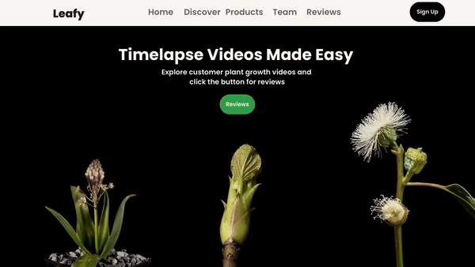

# Leafy.co - Company Website

Welcome to Leafy.co, a digital platform connecting users with nature, developed for CAT201 Assignment 2!


https://github.com/user-attachments/assets/228844e9-ffd9-42c3-8675-b8792b4bda86


**Website Overview:**
- **Company Info:** Discover Leafy.co, our mission, vision, and services.
- **Team Profiles:** Meet our team with photos and role descriptions.
- **Responsive Design:** Optimized for all devices using modern web tools.

## Prerequisites
- **Node.js:** Install the latest version from nodejs.org.
- **React.js:** Ensure you have React.js installed by running npx create-react-app.

## How to Run the Project:
1. **Clone the Repository:**
   ```bash
   git clone https://github.com/Lithia22/CAT201_Assignment_2.git


## Video Tutorial

[](https://youtu.be/ykFg49JdEuA?si=QelIdrzMge_R55oi)

Click on the image above to watch the website preview on YouTube.
